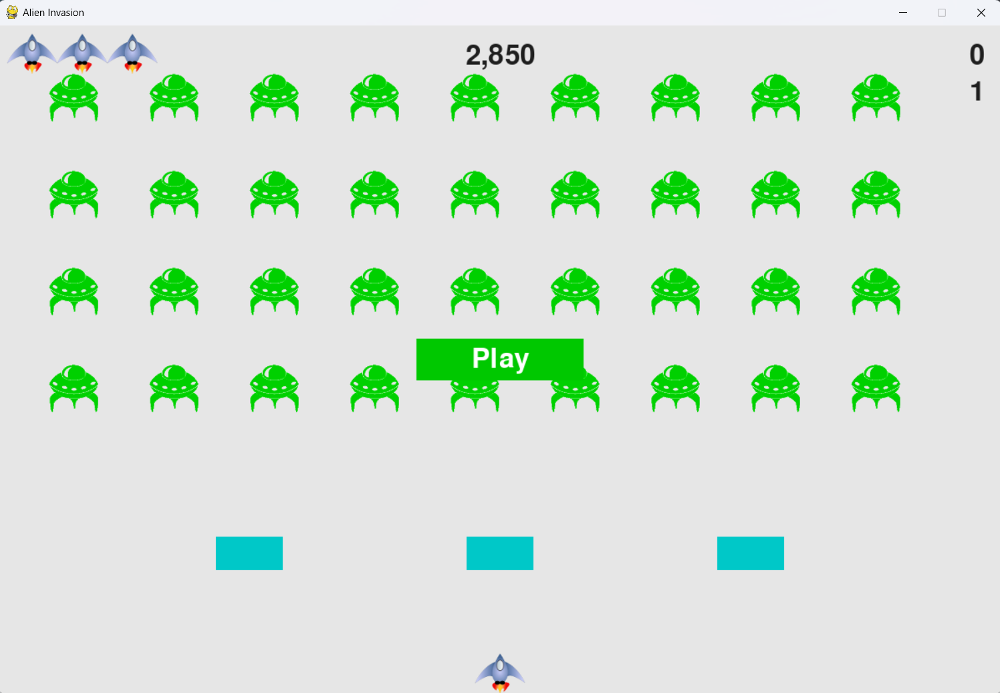

# 使用说明文档

安装环境：看requirements.txt文件
使用python版本：Python 3.10.18

运行程序说明：
程序入口：alien_invasion.py 点击运行即可打开游戏
可以看到如下画面

点击中间的play即可开始游戏
操作说明：
发射子弹：向外星人发射子弹按电脑的空格键
移动：按电脑的左右可左右移动
游戏规则：
中间的护盾可以抵挡外星人的攻击，护盾接收子弹到一定程度会被摧毁
一轮游戏只有3次复活的机会